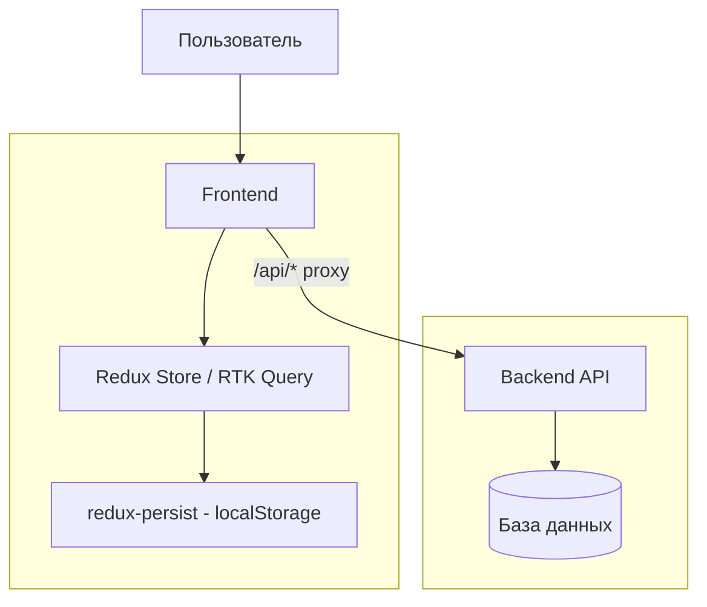
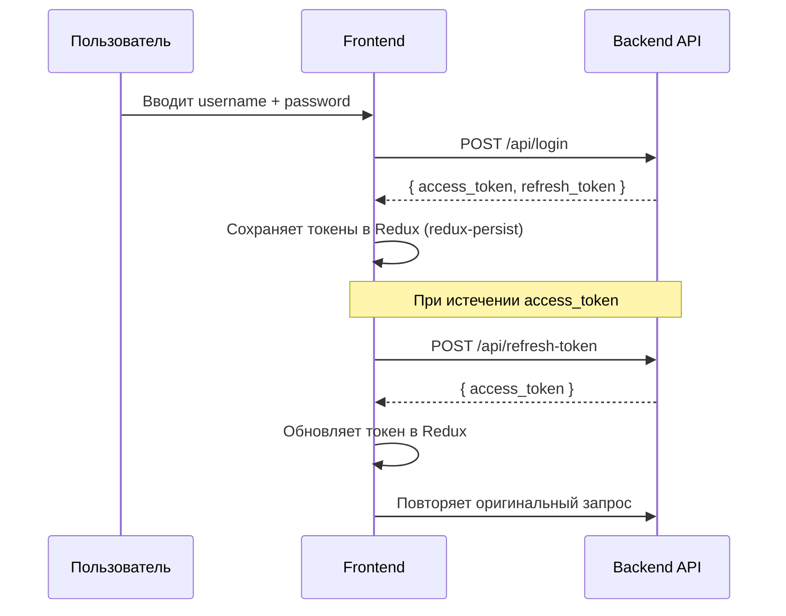

# Архитектура LogBoard (Frontend)

### Диаграмма системной архитектуры



---

**Технологии:**
- Next.js 16 (App Router)
- React 19
- Redux Toolkit + RTK Query
- redux-persist (сохранение auth-состояния в localStorage)
- TypeScript
- Tailwind CSS v4

**Прокси API:** (ВРЕМЕННО для разработки)

Все запросы с фронтенда идут через Next.js rewrite:
```
/api/* → http://localhost:8080/*  
```
Это решает проблему CORS в разработке.

---

### Структура Frontend (Feature-Sliced Design)

```
src/
├── app/              # Инициализация: store, провайдеры, роутинг (App Router)
│   ├── (auth)/       # Страницы: /login, /register
│   ├── (landing)/    # Главная страница
│   ├── (protected)/  # Защищённые страницы (dashboard)
│   ├── store/        # Redux store, rootReducer, redux-persist
│   └── provider/     # Provider-обёртка (Redux, Persistor)
│
├── entities/         # Бизнес-сущности
│   ├── user/         # Модель пользователя (User)
│   └── project/      # Модель проекта (Project)
│
├── features/         # Фичи (логика + UI)
│   ├── userAuth/     # Регистрация, вход, выход, JWT, authSlice
│   ├── projectWork/  # CRUD проектов, projectSlice
│   └── dashboard/    # Сайдбар, добавление проекта
│
├── shared/           # Переиспользуемое
│   ├── api/          # baseApi (RTK Query), обработка токенов
│   ├── lib/          # utils
│   └── ui/           # Общие компоненты (Button, Input, Modal...)
│
└── widgets/          # Крупные блоки UI
    └── landing/      # Секции лендинга (Header, Greeting, Features...)
```

---

## Аутентификация



**Реализация (`baseApi.ts`):**
- Публичные эндпоинты (`/register`, `/login`) — без токена
- Все остальные запросы — с заголовком `Authorization: Bearer <access_token>`
- При ответе `401` автоматически вызывает `/refresh-token`
- Если рефреш не удался — диспатчит `setLogout()`

---

## Управление состоянием (Redux)

```
store (redux-persist → localStorage)
└── auth (authSlice)
│   ├── isAuth: boolean
│   ├── user: User | null
│   ├── accessToken: string | null
│   └── refreshToken: string | null
└── base (RTK Query кэш)
```

**Actions:**
- `setAuth` — сохранить пользователя и токены после входа
- `setRefreshToken` — обновить access token
- `setLogout` — очистить состояние при выходе или ошибке рефреша
