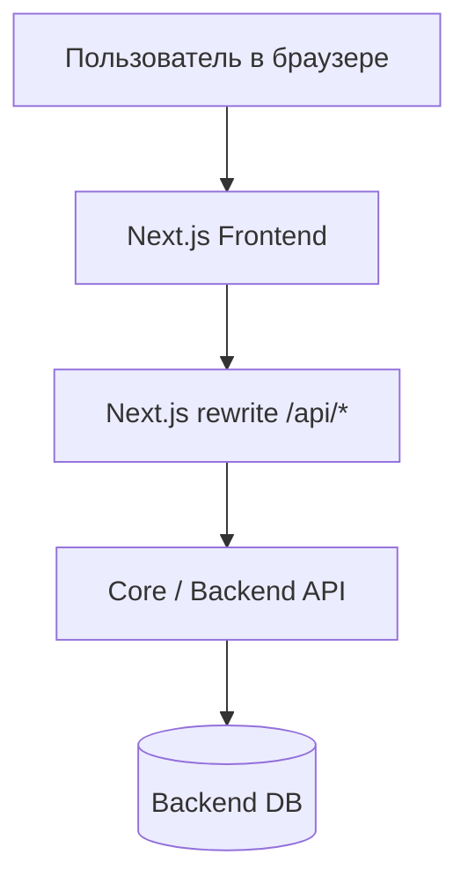
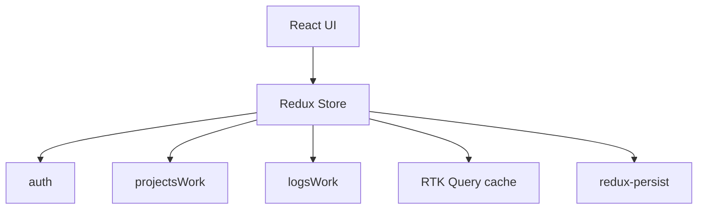
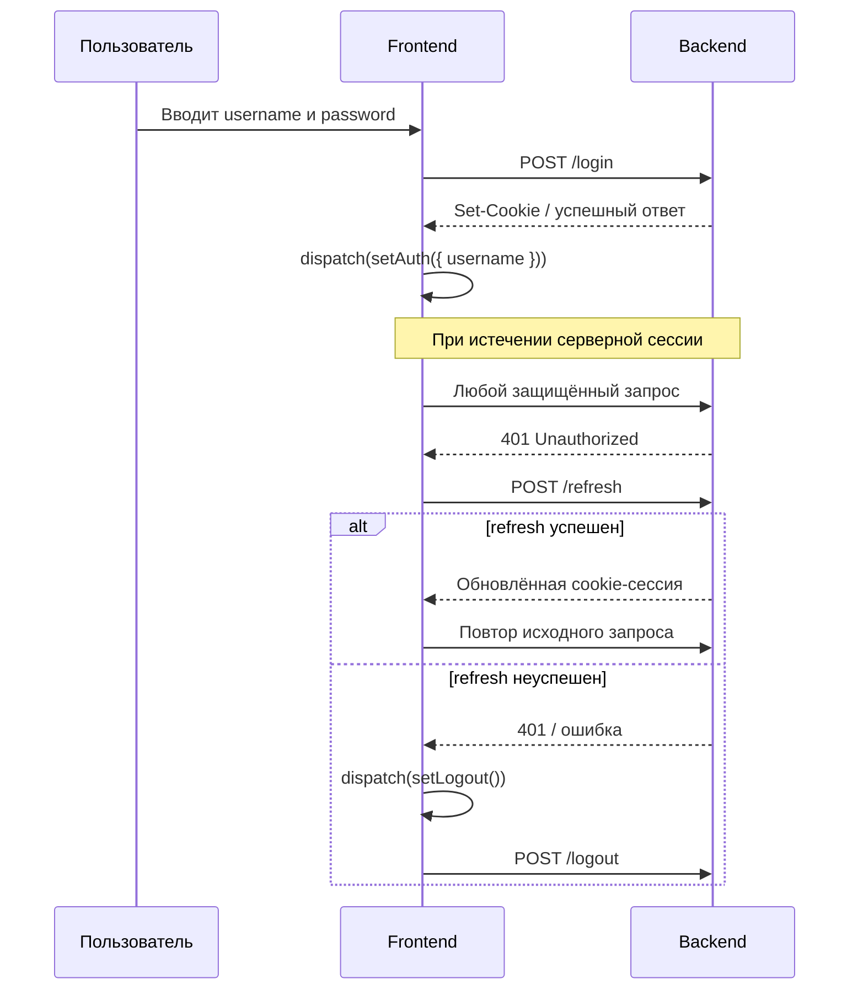
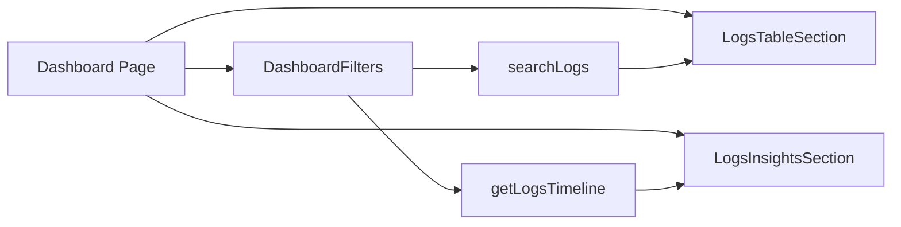
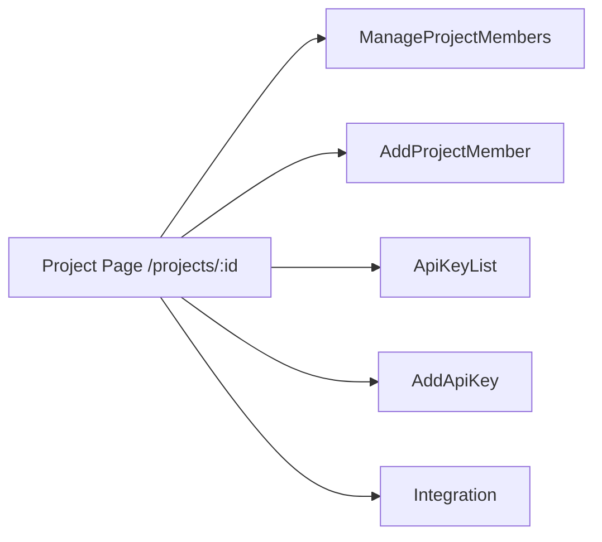

# Архитектура LogBoard (Frontend)

## Назначение

Клиентская часть программного продукта предназначена для эксплуатации в среде с доступом к
сети Интернет или локальной сети и используется через веб-браузер без установки
дополнительного программного обеспечения на стороне пользователя.

Основными пользователями программы являются разработчики, тестировщики и участники
небольших проектных команд. Клиентская часть используется ими в повседневной работе для
просмотра логов, контроля активности приложений, управления проектной структурой и доступа
к связанным с проектом данным.

## Системная архитектура


```mermaid
graph TD
    U[Пользователь в браузере]
    N[Next.js Frontend]
    P[Next.js rewrite /api/*]
    C[Core / Backend API]
    DB[(Backend DB)]

    U --> N
    N --> P
    P --> C
    C --> DB
```

### Ключевые принципы

- приложение построено на `Next.js 16` с `App Router`;
- пользовательский интерфейс реализован на `React 19` и `TypeScript`;
- глобальное состояние управляется через `Redux Toolkit`;
- серверные данные загружаются через `RTK Query`;
- часть клиентского состояния сохраняется через `redux-persist`;
- в разработке фронтенд обращается к backend через rewrite `/api/*`;
- в production `baseApi` может ходить напрямую в backend по настроенному адресу.

## Технологический стек

- `Next.js 16`
- `React 19`
- `TypeScript 5`
- `Redux Toolkit`
- `RTK Query`
- `redux-persist`
- `Tailwind CSS v4`
- `Radix UI`
- `lucide-react`
- `motion`
- `Vitest + Testing Library + jsdom`

## Feature-Sliced Design

Frontend организован по принципам `FSD`, где код разделён по уровням ответственности.

```text
src/
├── app/
│   ├── (auth)/                # /login, /register
│   ├── (protected)/           # защищённые маршруты
│   │   ├── dashboard/         # дашборд логов
│   │   └── projects/[id]/     # страница выбранного проекта
│   ├── (start)/               # публичные стартовые страницы
│   ├── provider/              # Redux Provider / PersistGate
│   └── store/                 # store, rootReducer, storage
│
├── entities/
│   ├── user/                  # типы и базовые UI пользователя
│   ├── project/               # типы проекта
│   ├── apiKey/                # типы API-ключей
│   └── log/                   # типы, форматтеры и UI логов
│
├── features/
│   ├── userAuth/              # login / register / logout
│   ├── projectWork/           # проекты и участники
│   ├── apiKeyWork/            # API-ключи проекта
│   ├── logWork/               # поиск логов и timeline
│   └── dashboard/             # dashboard UI и orchestration
│
├── shared/
│   ├── api/                   # baseApi, общие API-типы
│   ├── lib/                   # утилиты
│   └── ui/                    # переиспользуемые UI-компоненты
│
└── widgets/
    ├── landing/               # крупные блоки лендинга
    └── projects/              # крупные блоки страницы проекта
```

### Назначение слоёв

- `app` содержит маршрутизацию, layouts, глобальные провайдеры и настройку store;
- `shared` содержит переиспользуемые примитивы интерфейса, базовую API-конфигурацию и утилиты;
- `entities` описывает предметные сущности: пользователь, проект, API-ключ, лог;
- `features` реализует законченные пользовательские сценарии;
- `widgets` объединяет несколько фич и сущностей в крупные интерфейсные блоки.

## Маршруты и страницы

### Публичные маршруты

- `/` и `/landing` — стартовые страницы продукта;
- `/login` — страница авторизации;
- `/register` — страница регистрации.

### Защищённые маршруты

- `/dashboard` — просмотр логов выбранного проекта, фильтрация, таблица, аналитика;
- `/projects/[id]` — страница проекта с описанием, участниками, API-ключами и инструкцией по интеграции.

### Защита маршрутов

Защищённые маршруты обёрнуты в `src/app/(protected)/layout.tsx`. Layout проверяет
`state.auth.isAuth` и при отсутствии авторизации выполняет `router.replace("/login")`.

## Архитектура состояния


```mermaid
graph TD
    UI[React UI]
    STORE[Redux Store]
    AUTH[auth]
    PROJECTS[projectsWork]
    LOGS[logsWork]
    API[RTK Query cache]
    PERSIST[redux-persist]

    UI --> STORE
    STORE --> AUTH
    STORE --> PROJECTS
    STORE --> LOGS
    STORE --> API
    STORE --> PERSIST
```

### Состав store

`rootReducer` объединяет:

- `auth` — состояние авторизации;
- `projectsWork` — список проектов и выбранный проект;
- `logsWork` — фильтры и результаты логов;
- `base` — кэш `RTK Query`.

### Persisted state

Через `redux-persist` сохраняются:

- `auth`
- `projectsWork`

Состояние логов и кэш RTK Query не персистятся.

### Сброс состояния

При `setLogout` корневой reducer полностью сбрасывает клиентское состояние к начальному.
Дополнительно очищается кэш `RTK Query`, чтобы исключить отображение данных предыдущего
пользователя.

## Аутентификация и авторизация

Текущая реализация не использует хранение access/refresh токенов во frontend store.
Аутентификация построена на серверной сессии и cookie, а клиентская часть хранит только
признак авторизации и имя пользователя.

### Схема авторизации


```mermaid
sequenceDiagram
    participant U as Пользователь
    participant F as Frontend
    participant B as Backend

    U->>F: Вводит username и password
    F->>B: POST /login
    B-->>F: Set-Cookie / успешный ответ
    F->>F: dispatch(setAuth({ username }))

    Note over F,B: При истечении серверной сессии
    F->>B: Любой защищённый запрос
    B-->>F: 401 Unauthorized
    F->>B: POST /refresh
    alt refresh успешен
        B-->>F: Обновлённая cookie-сессия
        F->>B: Повтор исходного запроса
    else refresh неуспешен
        B-->>F: 401 / ошибка
        F->>F: dispatch(setLogout())
        F->>B: POST /logout
    end
```

### Реализация в `baseApi`

Базовая конфигурация API находится в `src/shared/api/baseApi.ts`.

Ключевые особенности:

- публичные маршруты: `/register`, `/login`, `/refresh`;
- `credentials: "include"` — cookie автоматически отправляются с каждым запросом;
- для `/logout` используется `redirect: "manual"`, чтобы корректно обработать выход;
- при `401` для защищённого запроса включается mutex-механизм, чтобы только один запрос
  выполнял `POST /refresh`;
- после успешного refresh исходный запрос повторяется;
- при неуспешном refresh frontend выполняет `setLogout()`.

### Auth state

`authSlice` хранит только:

- `isAuth: boolean`
- `username: string`

Таким образом, frontend не хранит в Redux чувствительные токены доступа и работает с уже
установленной backend-сессией.

## Слой API

Все серверные запросы описаны через `RTK Query` и разделены по feature-уровням.

### `userAuth`

- `POST /register`
- `POST /login`
- `POST /logout`

### `projectWork`

- `POST /projects`
- `GET /projects`
- `DELETE /projects/:id`
- `GET /projects/:projectId/members`
- `POST /projects/:projectId/members`
- `PATCH /projects/:projectId/members/:userId`
- `DELETE /projects/:projectId/members/:userId`

### `apiKeyWork`

- `POST /api-keys`
- `GET /api-keys?projectId=...`
- `DELETE /api-keys/:keyId`

### `logWork`

- `POST /logs/search`
- `POST /logs/timeline`

## Архитектура пользовательских сценариев

### Авторизация

1. Пользователь открывает `/login`.
2. Вводит `username` и `password`.
3. `loginUser` отправляет `POST /login`.
4. При успехе `LoginCard` диспатчит `setAuth`.
5. Пользователь переходит в защищённую часть приложения.

### Выбор проекта

1. После входа загружается список проектов.
2. Пользователь выбирает активный проект.
3. Выбранный проект сохраняется в `projectsWork`.
4. Другие страницы используют выбранный проект как источник `projectId`.

### Работа со страницей проекта `/projects/[id]`

Страница проекта объединяет несколько блоков:

- описание проекта;
- список участников и управление ролями;
- список API-ключей;
- создание API-ключей;
- инструкция по интеграции.

`/projects/[id]` получает `id` из маршрута и находит проект в `projectsWork.projects`.
Если проект отсутствует, пользователь перенаправляется обратно на `/dashboard`.

### Работа с дашбордом `/dashboard`

Дашборд использует выбранный проект из `projectsWork` и показывает:

- фильтры поиска логов;
- таблицу логов;
- постраничную подгрузку;
- таймлайн логов;
- агрегированные метрики.

Запросы делятся по назначению:

- `searchLogs` — детальные записи для таблицы;
- `getLogsTimeline` — агрегированная временная серия для графика.

## Диаграмма дашборда логов


```mermaid
graph LR
    D[Dashboard Page]
    F[DashboardFilters]
    T[LogsTableSection]
    I[LogsInsightsSection]
    S[searchLogs]
    TL[getLogsTimeline]

    D --> F
    D --> T
    D --> I
    F --> S
    F --> TL
    S --> T
    TL --> I
```

## Диаграмма страницы проекта


```mermaid
graph LR
    P[Project Page /projects/:id]
    M[ManageProjectMembers]
    A[AddProjectMember]
    K[ApiKeyList]
    C[AddApiKey]
    G[Integration]

    P --> M
    P --> A
    P --> K
    P --> C
    P --> G
```

## Инфраструктурные настройки

### Прокси в разработке

В development frontend использует относительный API-префикс `/api`, а `Next.js` через
`rewrites` проксирует запросы в backend. Актуальный адрес rewrite задаётся в
`next.config.ts`.

### Production API

В production `baseApi` использует настроенный backend URL напрямую. Это поведение описано в
`src/shared/api/baseApi.ts`.

### Контейнеризация

Frontend подготовлен к контейнерному запуску:

- `Dockerfile`
- `docker-compose.yml`

Это позволяет запускать клиентскую часть в воспроизводимой среде и использовать одинаковую
схему запуска на разных машинах.

## Тестовая архитектура

Проект покрыт несколькими уровнями тестов:

- `unit` — редьюсеры, валидаторы, форматтеры, date helpers;
- `component` — формы авторизации, списки, фильтры, таблицы и аналитические блоки;
- `integration` — protected layout, dashboard page, sidebar, root reducer.

Тесты реализованы на:

- `Vitest`
- `@testing-library/react`
- `jsdom`

## Итог

Frontend LogBoard представляет собой FSD-организованное React/Next.js-приложение,
ориентированное на работу с проектами и логами. Архитектура строится вокруг:

- маршрутов `App Router`;
- глобального Redux state;
- API-слоя на `RTK Query`;
- backend-сессии с cookie и refresh-flow;
- разделения доменных сущностей и пользовательских сценариев по слоям FSD.
