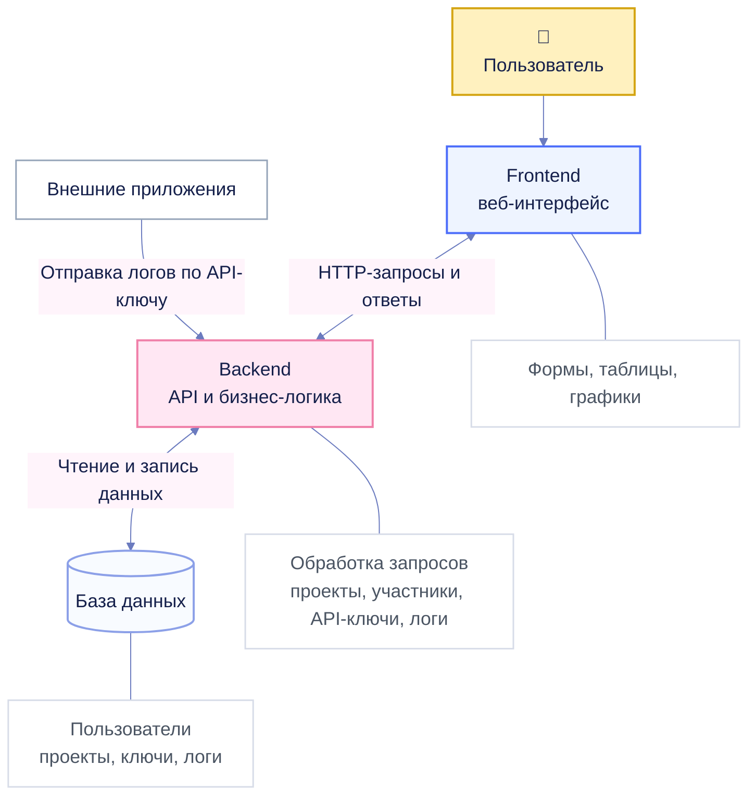

# Общая архитектура приложения LogBoard

```mermaid
%%{init: {
  "theme": "base",
  "themeVariables": {
    "background": "#f3f4f6",
    "primaryColor": "#eef4ff",
    "primaryTextColor": "#15204B",
    "primaryBorderColor": "#4C6DFA",
    "lineColor": "#6B7BBF",
    "secondaryColor": "#fff4fb",
    "tertiaryColor": "#f8fafc",
    "fontSize": "18px"
  }
}}%%
flowchart TB
    U["👤<br/>Пользователь"]
    F["Frontend<br/>веб-интерфейс"]
    B["Backend<br/>API и бизнес-логика"]
    D[("База данных")]
    E["Внешние приложения"]
    F1["Формы, таблицы, графики"]
    B1["Обработка запросов<br/>проекты, участники, API-ключи, логи"]
    D1["Пользователи<br/>проекты, ключи, логи"]

    U --> F
    F <-->|HTTP-запросы и ответы| B
    B <-->|Чтение и запись данных| D
    E -->|Отправка логов по API-ключу| B

    F --- F1
    B --- B1
    D --- D1

    classDef user fill:#fff1bf,stroke:#d4a514,color:#15204B,stroke-width:2px;
    classDef frontend fill:#eef4ff,stroke:#4C6DFA,color:#15204B,stroke-width:2px;
    classDef backend fill:#ffe7f3,stroke:#F07FA8,color:#15204B,stroke-width:2px;
    classDef data fill:#f8fbff,stroke:#8ca0e8,color:#15204B,stroke-width:2px;
    classDef note fill:#ffffff,stroke:#d7dce8,color:#4b5563,stroke-width:1.5px;
    classDef external fill:#ffffff,stroke:#94a3b8,color:#15204B,stroke-width:1.5px;

    class U user;
    class F frontend;
    class B backend;
    class D data;
    class F1,B1,D1 note;
    class E external;
```
