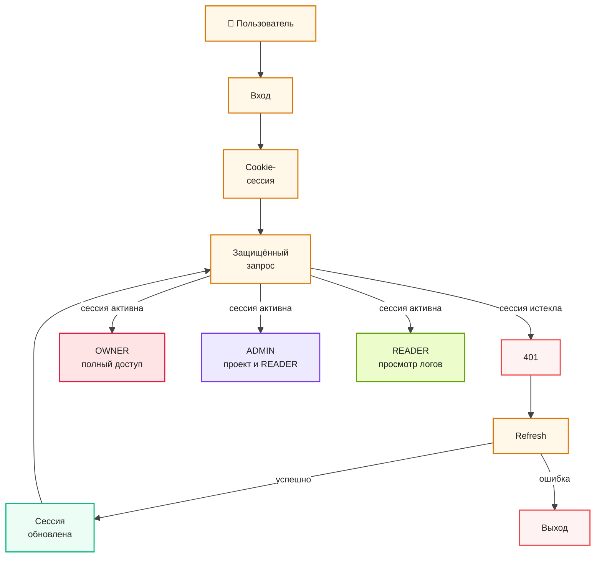

# Авторизация и разграничение прав доступа

Авторизация в системе построена на серверной сессии и cookie. При истечении сессии
клиентская часть автоматически пытается обновить её через `refresh`, а доступные
действия пользователя определяются его ролью в проекте: `OWNER`, `ADMIN` или `READER`.
