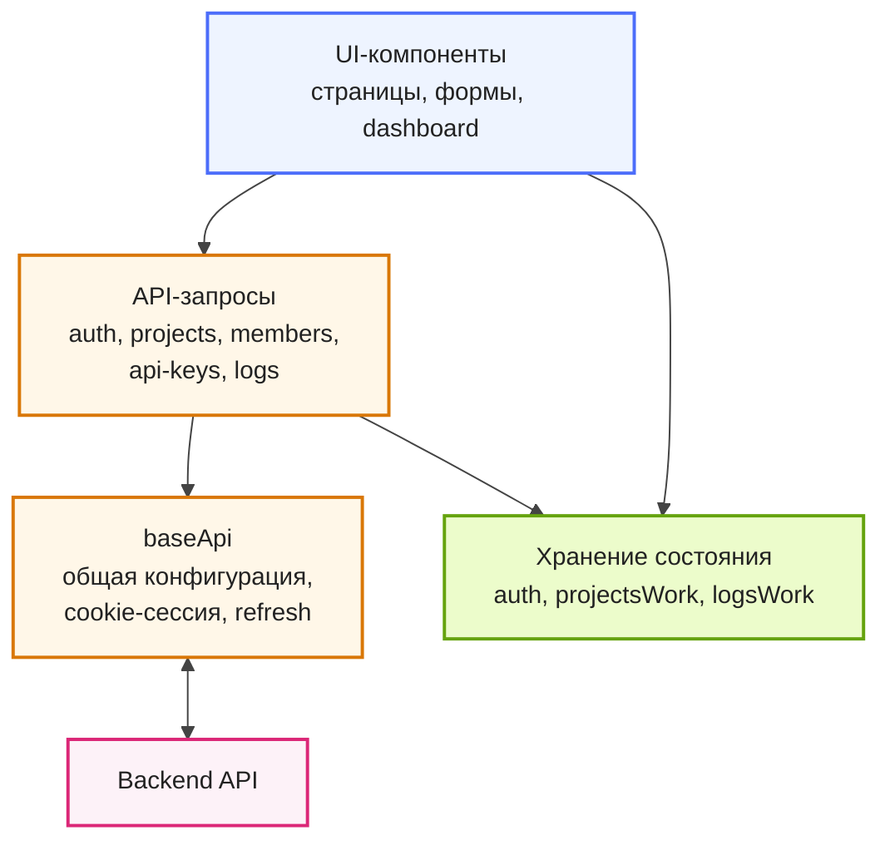

# Клиентская бизнес-логика LogBoard

Клиентская бизнес-логика разделена на уровни: `baseApi` отвечает за общее взаимодействие
с backend, слой API-запросов реализует прикладные обращения к серверу, а слой хранения
состояния управляет ключевыми данными приложения.
